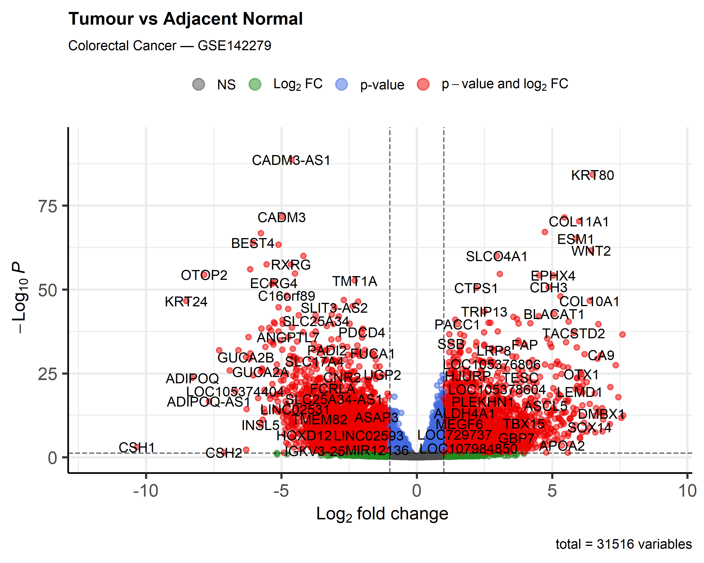
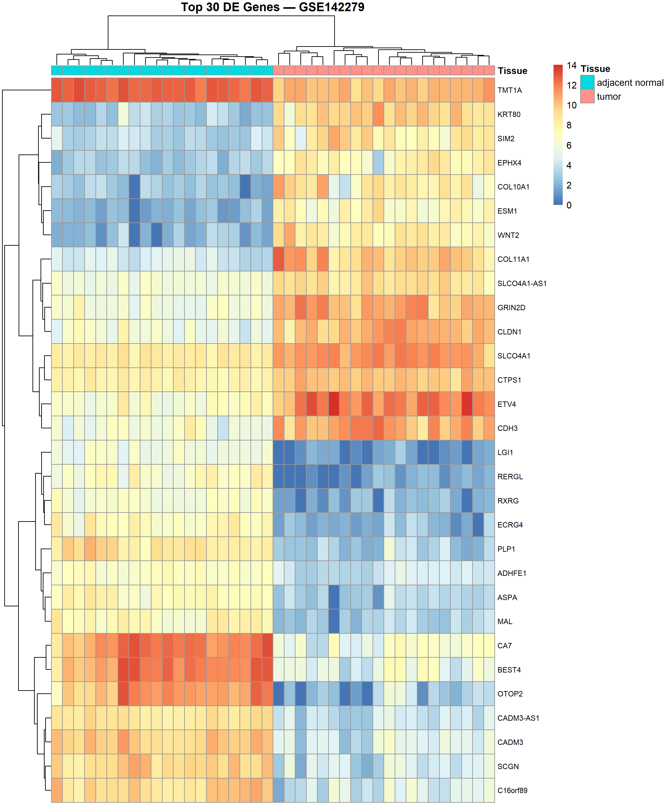

# Differential Expression Analysis of Colorectal Cancer (GSE142279)

## Background
Colorectal cancer is one of the most common cancers worldwide. Identifying genes 
that are differentially expressed between tumour and normal tissue can provide 
insight into the molecular mechanisms that drive disease progression.

## Data
- **Source:** NCBI GEO, accession GSE142279
- **Samples:** 20 colorectal tumour samples and 20 adjacent normal tissue samples
- **Data type:** RNA-seq raw counts (GRCh38)

## Methods
Differential expression analysis was performed in R using the DESeq2 package. Raw counts were 
normalised using DESeq2's median of ratios method. Genes were considered 
significantly differentially expressed at padj < 0.05 and |log2FoldChange| > 1. 
Gene symbol annotation was performed using org.Hs.eg.db. Visualisation was 
produced using EnhancedVolcano and pheatmap.

## Results
A total of 7,770 genes were significantly differentially expressed (padj < 0.05, 
|log2FoldChange| > 1), representing approximately 47% of expressed genes. Of these, 
3,265 were upregulated and 4,505 were downregulated in tumour relative to normal 
tissue. Key upregulated genes included KRT80, COL11A1, ESM1 and WNT2, consistent 
with known roles in tumour invasion and epithelial remodelling. Key downregulated 
genes included BEST4 and CADM3, suggesting loss of normal epithelial 
identity in tumour tissue.

## Visualisations

## Requirements
- R (>= 4.0)
- DESeq2
- org.Hs.eg.db
- EnhancedVolcano
- pheatmap